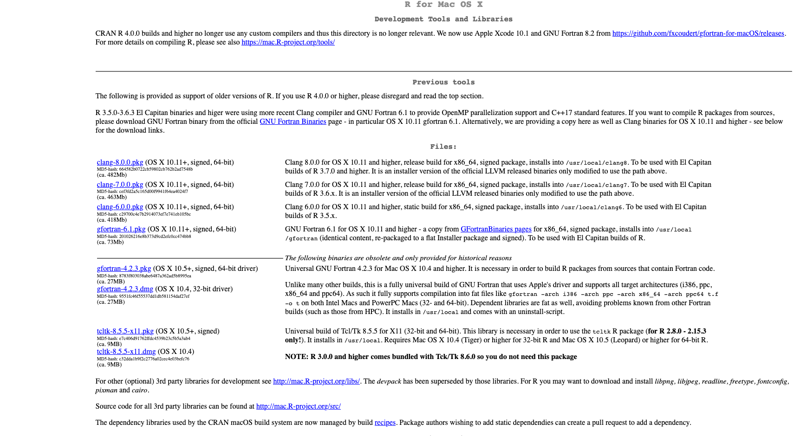

by Rodrigo Esteves de Lima Lopes *University of Campinas*  rll307\@unicamp.br](mailto:rll307@unicamp.br)

------------------------------------------------------------------------
# R - Installing R

## Introduction

[R](https://www.r-project.org/) é um software de análise estatística. Não foi inicialmente pensado para estudos de linguagem; no entanto, provou ser bastante útil para tal campo de investigação. [R](https://www.r-project.org/) é orientado a objetos: cada vez que carregamos um pacote, há um novo conjunto pré-definido de funções. Não criaremos pacotes, mas usaremos pacotes e suas funções para fazer nossos tutoriais. Aqui [R](https://www.r-project.org/) nos servirá para analisar e plotar dados. Sabemos que o R pode fazer muito mais, mas essa será nossa pequena esta introdução.

## Download R

Vá para o site do [R](https://www.r-project.org/) e baixe a versão mais recente do R para o seu computador. Existem versões binárias para macOS, Linux e Windows. Eu não tenho um computador Windows desde 1999, então provavelmente não poderei ajudá-lo muito se você tiver um problema específico do Windows.

Depois de instalar o R, sugiro fortemente que você baixe e instale algumas ferramentas que podem nos ajudar a instalar alguns pacotes. Se você estiver usando um computador macOS, role até a parte inferior e clique em *ferramentas*, instale o seguinte:

-   clang
-   gfortran
-   tcltk

Se está usando Windows, baixe e instale rtools.exe.

