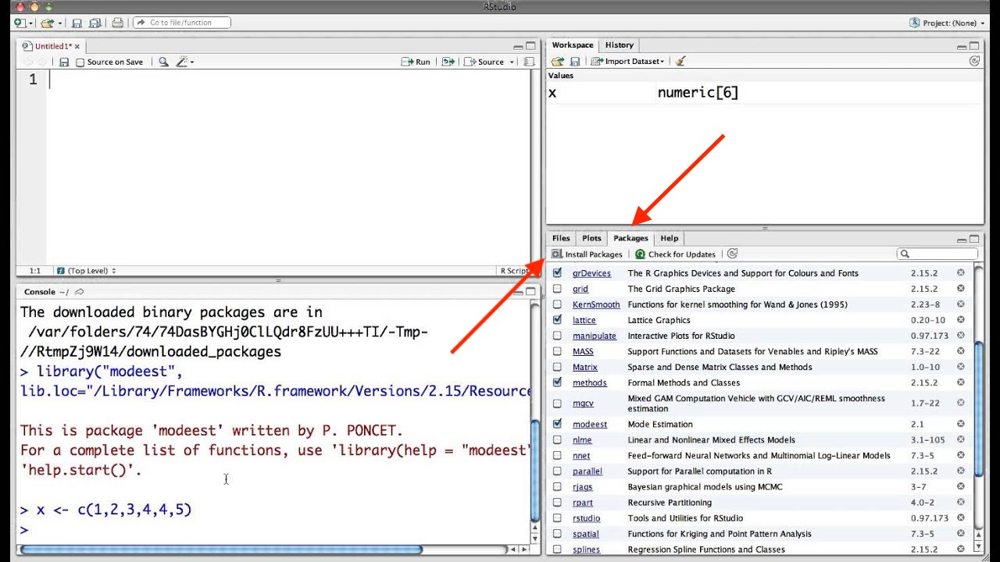

by Rodrigo Esteves de Lima Lopes *University of Campinas*  [rll307\@unicamp.br](mailto:rll307@unicamp.br)

------------------------------------------------------------------------

# Instalação usando o seu IDE

Para instalar o pacote usando seu suporte IDE, você terá que procurar
a aba `pacotes`. Clique nela e verá uma lista de pacotes do seu sistema, aqueles com o *tick* são carregados. Para carregar um pacote do IDE sem código, apenas *tick* pacote. Para instalar um pacote, clique em instalar pacotes, digite o nome do pacote e o IDE fará o trabalho para você. Por favor, não se esqueça de escolher *instalar
dependências*, para que tudo corra bem. As imagens abaixo mostram o processo:




# Instalar usando a linha de comando

Acesse o console e digite:

``` r
install.packages('gutenbergr', dependencies=TRUE)
```

Se precisar ajuda, digite no seu console:

``` r
?install.packages()
```

Este procedimento é padrão em todos os comandos do R. Se você digitar **?** seguido
por um comando, ele exibirá ajuda nesse comando automaticamente.

# Se você tiver sorte

Se você tiver sorte, uma mensagem pode aparecer no topo do seu script
editor. Este é o RStudio pedindo para você instalar o pacote, basta clicar nela.


