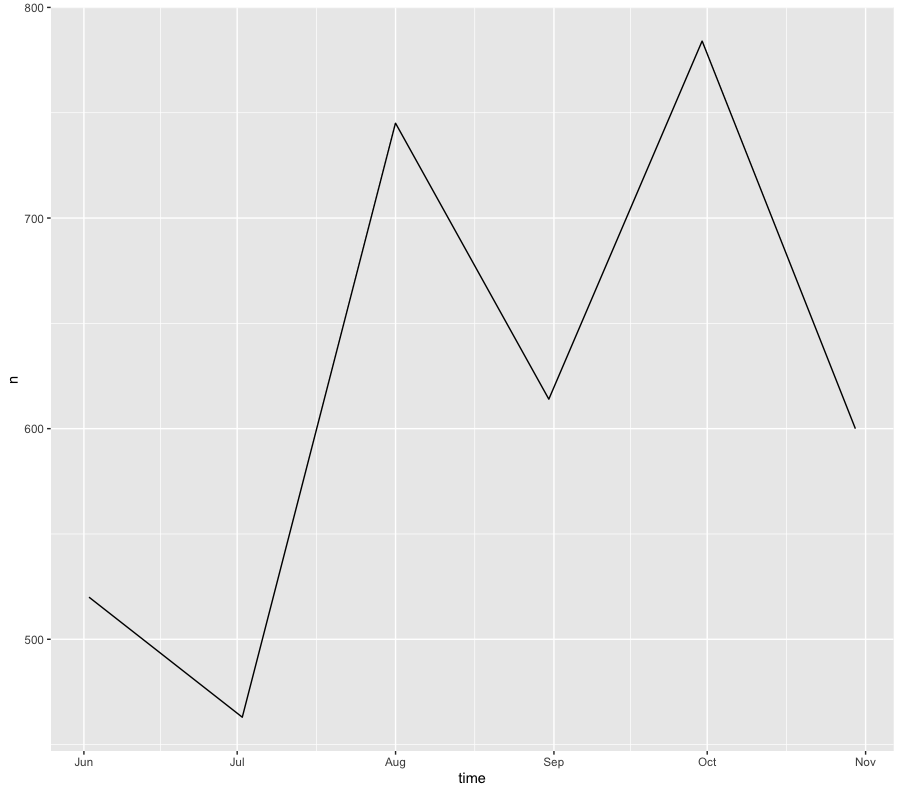
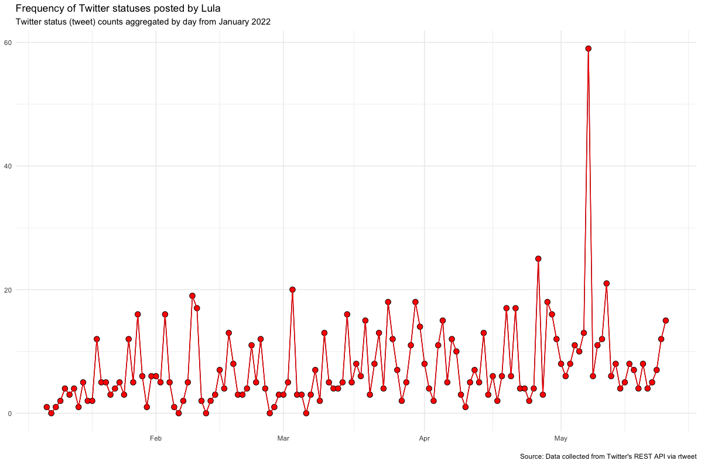

By Rodrigo Esteves de Lima Lopes *University of Campinas* [rll307\@unicamp.br](mailto:rll307@unicamp.br)

------------------------------------------------------------------------

# Minha primeira raspagem de dados do Twitter

# Introdução

Nosso principal objetivo é ter um primeiro contato com um pacote de raspagem de dados. Neste caso, `rtweet`. O Twitter tem sido uma das mídias sociais mais antigas e também uma importante fonte de dados nos últimos anos. Mas, por favor, leve em consideração que os dados que coletamos podem ser influenciados por vários fatores:

1. O algoritmo do Twitter é conhecido por alterar os resultados dependendo da nossa localização
2. Um tipo diferente de conta (profissional, pessoal ou premium) oferece resultados diferentes
3. Nossa banda de Internet pode influenciar os resultados

## O que vamos precisar

1. Uma conta válida do [Twitter](https://twitter.com/)
2. O pacote [rtweet](https://github.com/rpensci/rtweet) para extração de dados

### Uso responsável de dados

Lembre-se de que qualquer extração de dados deve ser feita de acordo com os [termos e condições](https://developer.twitter.com/en/developer-terms/more-on-restricted-use-cases) do Twitter.

# Raspagem de alguns dados

Carregando os pacotes:

``` r
library(rtweet)
library(ggplot2)
```

## Locais no Twitter

Primeiro, vamos obter alguns insights sobre o que é tendência em nossa localização. Então começamos verificando quais são os locais disponíveis:

``` r
all.trends <- trends_available()
```

Se olharmos de perto, `my.trends <- trends_available()` fornece uma tabela com números, cidades e países. Eu sou de São Paulo - Brasil, então tentarei descobrir as tendências disponíveis por lá. Se olharmos na tabela, o ID de São Paulo é `455827`. Portanto, obteremos as tendências em São Paulo usando esse ID.

``` r
SP.trends <- get_trends(woeid = 455827)
```

Novamente temos uma tabela. É um instantâneo do Twitter no momento em que os dados foram coletados, tende a mudar, às vezes, a cada minuto.

## Obtendo alguns tweets

Nos meus dados, o termo **URSS** chamou minha atenção, então vou procurá-lo. Existem duas maneiras de fazê-lo:

1. `stream_tweets()`: pesquisa tweets por um determinado período de tempo.
2. `search_tweets()`: pesquisa tweets até obter o número especificado de tweets.
### stream_tweets

- **Vantagens**: coleta o máximo de tweets possível em um determinado período de tempo.
- **Desvantagens**: tende a apresentar erros de conexão e análise quando pesquisamos por longos períodos de tempo. Existe uma função chamada recover_stream.R, escrita por [Johannes Gruber](https://github.com/JBGruber) (a quem somos profundamente gratos) disponível [aqui](https://gist.github.com/JBGruber), isso pode resolver o problema às vezes. No entanto, se nosso arquivo estiver muito danificado, pode não funcionar.

Vamos fazer algumas buscas usando `stream_tweets`:

``` r
stream_tweets('URSS', 
                       timeout = 60, #em segundos
                       file_name='t01', # salva os tweets num arquivo
                       parse=FALSE)
```

Agora vamos usar o seguinte comando para carregar os tweets:

``` r
my.tweets <- parse_stream("t01.json")
```

Se olharmos para este arquivo, há muitas variáveis ​​possíveis para explorar, mais de 90 colunas com muitas informações sobre nossos tweets.

### search_tweets()

-   **Vantagens**: sempre retorna arquivos bem organizadinhos em colunas (parse).
-   **Desvantagens**: Se sua conta nao for "researcher" ou "premiu", o número de insâncias pode ser limitado.

Como tempos pouco tempo, vamos buscar apenas alguns tweets:

``` r
my.Tweets2 <- search_tweets(
  "URSS", n = 1000, include_rts = TRUE)
```

Vamos pegar a linha do tempo de um político:

``` r
boulos <-  get_timeline("GuilhermeBoulos",n=1000)
```

Agora vamos pegar seus seguidores:

``` r
boulos.flw <- get_followers("GuilhermeBoulos", n = 75000)
```

E agora algumas inforções sobre os seguidores:

``` r
boulos.flw2 <- boulos.flw[1:100,]
info <- lookup_users(boulos.flw2$user_id)
```

Como desobrir usuários que tuitara sobre nosso termo de busca:

``` r
users <- search_users("URSS", n = 1000)
```

# Linhas do tempo

Vejamos os cronogramas de alguns possíveis candidatos nas próximas eleições brasileiras:

``` r
presidents <- get_timelines(c("jairbolsonaro",
                              "LulaOficial",
                              "cirogomes"),
                            n = 3200)
```


Agora vamos salvar nossos dados fora do R, caso queiramos analisar os textos em outro software:

```r
presidets.save  <- data.frame(lapply(presidents, as.character), stringsAsFactors=FALSE)
write.csv(presidets.save, "presidents.csv")
```

# Agora vamos plotar a frequência

O básico, um plot para todos:

``` r
presidents %>% ts_plot("month", trim = 7L)
```



`ts_plot()` é parte de `rtweet`. Ele "empresta" alguns elementos do `ggplot2` para plotar frequências de tweets como séries temporais.É possível tornar a representação visual um pouco mais sofisticada fornecendo vários filtros baseados em texto para subconjunto de dados. Também é possível traçar várias séries temporais.

Como podemos ver, esta imagem não nos dá muitas informações sobre os tweets. Então vamos tornar o gráfico um pouco mais complexo, considerando cada candidato:

**Jair Bolsonaro**

``` r
presidents %>%
  dplyr::filter(created_at > "2022-01-01") %>%
  dplyr::filter(screen_name == "jairbolsonaro") %>%
  ts_plot("day", trim = 7L) +
  ggplot2::geom_point(color = "black",shape=21,fill="blue",size = 3) +
  ggplot2::geom_line(color = "blue")+
  ggplot2::theme_minimal() +
  ggplot2::labs(
    x = NULL, y = NULL,
    title = "Frequência de status do Twitter postados por Jair Bolsonaro",
    subtitle = "Contagens de status do Twitter (tweet) agregadas por dia a partir de janeiro de 2022",
    caption = "\nFonte: Dados coletados da API REST do Twitter via rtweet"
  )
```


**Ciro Gomes**

``` r
presidents %>%
  dplyr::filter(created_at > "2022-01-01") %>%
  dplyr::filter(screen_name == "cirogomes") %>%
  ts_plot("day", trim = 7L) +
  ggplot2::geom_point(color = "black",shape=21,fill="darkgreen",size = 3) +
  ggplot2::geom_line(color = "darkgreen")+
  ggplot2::theme_minimal() +
  ggplot2::labs(
    x = NULL, y = NULL,
    title = "Frequência de status do Twitter postados por Ciro Gomes",
    subtitle = "Contagens de status do Twitter (tweet) agregadas por dia a partir de janeiro de 2022",
    caption = "\nFonte: Dados coletados da API REST do Twitter via rtweet"
  )
```


**Lula**

``` r
presidents %>%
  dplyr::filter(created_at > "2022-01-01") %>%
  dplyr::filter(screen_name == "LulaOficial") %>%
  ts_plot("day", trim = 7L) +
  ggplot2::geom_point(color = "black",shape=21,fill="red",size = 3) +
  ggplot2::geom_line(color = "red")+
  ggplot2::theme_minimal() +
  ggplot2::labs(
    x = NULL, y = NULL,
    title = "Frequency of Twitter statuses posted by Lula",
    subtitle = "Twitter status (tweet) counts aggregated by day from January 2022",
    caption = "\nSource: Data collected from Twitter's REST API via rtweet"
  )
```



Nos comandos acima, vários filtros e novos critérios mudaram a forma como os dados eram representados. Em poucas palavras nós:

1. escolhemos um único candidato
2. definimos um formulário de dados da linha do tempo para iniciar
3. definimos uma cor para cada candidato
4. definimos o tamanho


Agora, vamos traçar todos os presidentes em um único comando:

``` r
presidents %>%
  dplyr::filter(created_at > "2021-08-01") %>%
  dplyr::group_by(screen_name) %>%
  ts_plot("day", trim = 7L) +
  ggplot2::geom_point(size = 3, aes(shape = factor(screen_name),color = factor(screen_name))) +
  ggplot2::theme_minimal() +
  ggplot2::theme(
    legend.title = ggplot2::element_blank(),
    legend.position = "bottom",
    plot.title = ggplot2::element_text(face = "bold")) +
  ggplot2::labs(
    x = NULL, y = NULL,
    title = "Frequência de status do Twitter postados por pré-candidatos à presidência do Brasil",
    subtitle = "Contagens de status do Twitter (tweet) agregadas por data",
    caption = "\nFonte: Dados coletados da API REST do Twitter via rtweet"
  )
```


Em resumo, nós:

1. escolhemos todos os candidatos
2. agrupamos as ocorrências por nome de usuário
3. definimos um local na linha do tempo para iniciar
4. definimos uma cor e forma para cada candidato
5. definimos o tamanho

Que conclusões podemos tirar?
