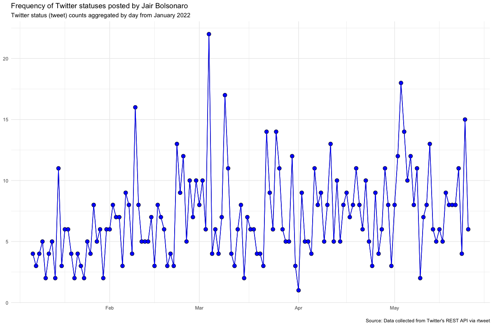
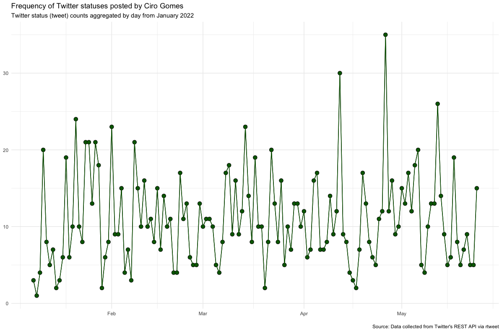

By Rodrigo Esteves de Lima Lopes *Campinas University* [rll307\@unicamp.br](mailto:rll307@unicamp.br)

------------------------------------------------------------------------

# Plotagem

# Introdução

Nosso objetivo aqui é traçar os resultados que coletamos no último script. A gramática da plotagem pode ser um pouco difícil, mas lembre-se de que esta é apenas uma pequena introdução.

Neste tutorial usamos [`ggplot2`](https://ggplot2.tidyverse.org/index.html), um pacote para plotagem em R. Outros pacotes devem fazer o trabalho, mas `ggplot2` é o mais popular em usuários do `R`. O pacote [Dplyr](https://dplyr.tidyverse.org/) pode ser necessário para manipulação de dados.

# Agora vamos plotar a frequência

O básico, um plot para todos:

``` r
presidents %>% ts_plot("month", trim = 7L)
```


`ts_plot()` é parte de `rtweet`. Ele "empresta" alguns elementos do `ggplot2` para plotar frequências de tweets como séries temporais.É possível tornar a representação visual um pouco mais sofisticada fornecendo vários filtros baseados em texto para subconjunto de dados. Também é possível traçar várias séries temporais.

Como podemos ver, esta imagem não nos dá muitas informações sobre os tweets. Então vamos tornar o enredo um pouco mais complexo, agora considerando cada candidato:

**Jair Bolsonaro**

``` r
presidents %>%
  dplyr::filter(created_at > "2022-01-01") %>%
  dplyr::filter(screen_name == "jairbolsonaro") %>%
  ts_plot("day", trim = 7L) +
  ggplot2::geom_point(color = "black",shape=21,fill="blue",size = 3) +
  ggplot2::geom_line(color = "blue")+
  ggplot2::theme_minimal() +
  ggplot2::labs(
    x = NULL, y = NULL,
    title = "Frequência de status do Twitter postados por Jair Bolsonaro",
    subtitle = "Contagens de status do Twitter (tweet) agregadas por dia a partir de janeiro de 2022",
    caption = "\nFonte: Dados coletados da API REST do Twitter via rtweet"
  )
```



**Ciro Gomes**

``` r
presidents %>%
  dplyr::filter(created_at > "2022-01-01") %>%
  dplyr::filter(screen_name == "cirogomes") %>%
  ts_plot("day", trim = 7L) +
  ggplot2::geom_point(color = "black",shape=21,fill="darkgreen",size = 3) +
  ggplot2::geom_line(color = "darkgreen")+
  ggplot2::theme_minimal() +
  ggplot2::labs(
    x = NULL, y = NULL,
    title = "Frequência de status do Twitter postados por Ciro Gomes",
    subtitle = "Contagens de status do Twitter (tweet) agregadas por dia a partir de janeiro de 2022",
    caption = "\nFonte: Dados coletados da API REST do Twitter via rtweet"
  )
```



**Lula**

``` r
presidents %>%
  dplyr::filter(created_at > "2022-01-01") %>%
  dplyr::filter(screen_name == "LulaOficial") %>%
  ts_plot("day", trim = 7L) +
  ggplot2::geom_point(color = "black",shape=21,fill="red",size = 3) +
  ggplot2::geom_line(color = "red")+
  ggplot2::theme_minimal() +
  ggplot2::labs(
    x = NULL, y = NULL,
    title = "Frequency of Twitter statuses posted by Lula",
    subtitle = "Twitter status (tweet) counts aggregated by day from January 2022",
    caption = "\nSource: Data collected from Twitter's REST API via rtweet"
  )
```


Nos comandos acima, vários filtros e novos critérios mudaram a forma como os dados eram representados. Em poucas palavras nós:

1. escolhemos um único candidato
2. definimos um formulário de dados da linha do tempo para iniciar
3. definimos uma cor para cada candidato
4. definimos o tamanho


Agora, vamos traçar todos os presidentes em um único comando:

``` r
presidents %>%
  dplyr::filter(created_at > "2021-08-01") %>%
  dplyr::group_by(screen_name) %>%
  ts_plot("day", trim = 7L) +
  ggplot2::geom_point(size = 3, aes(shape = factor(screen_name),color = factor(screen_name))) +
  ggplot2::theme_minimal() +
  ggplot2::theme(
    legend.title = ggplot2::element_blank(),
    legend.position = "bottom",
    plot.title = ggplot2::element_text(face = "bold")) +
  ggplot2::labs(
    x = NULL, y = NULL,
    title = "Frequência de status do Twitter postados por pré-candidatos à presidência do Brasil",
    subtitle = "Contagens de status do Twitter (tweet) agregadas por data",
    caption = "\nFonte: Dados coletados da API REST do Twitter via rtweet"
  )
```


Em resumo, nós:

1. escolhemos todos os candidatos
2. agrupamos as ocorrências por nome de usuário
3. definimos um local na linha do tempo para iniciar
4. definimos uma cor e forma para cada candidato
5. definimos o tamanho

Que conclusões podemos tirar?
