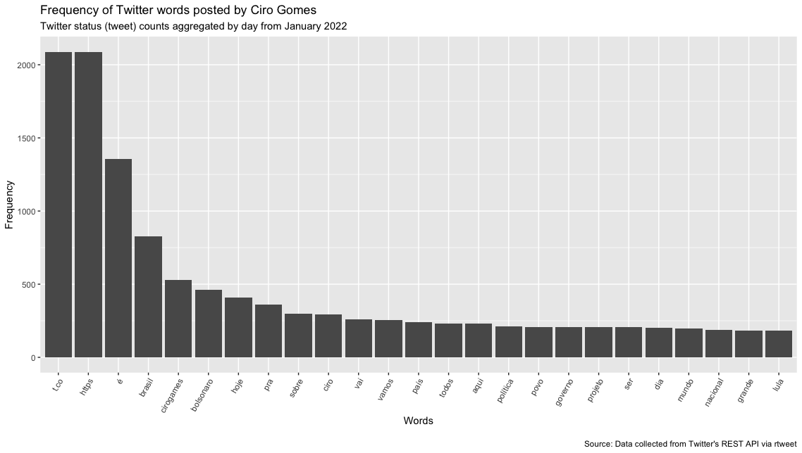

By Rodrigo Esteves de Lima Lopes *Campinas University* [rll307\@unicamp.br](mailto:rll307@unicamp.br)

------------------------------------------------------------------------

# Plotagem

# Introdução

Nosso objetivo aqui é traçar os resultados que coletamos no último script. A gramática da plotagem pode ser um pouco esmagadora, mas lembre-se de que é apenas uma pequena introdução.

Neste tutorial usamos [`ggplot2`](https://ggplot2.tidyverse.org/index.html), um pacote para plotagem em R. Outros pacotes devem fazer o trabalho, mas `ggplot2` é o mais popular em usuários do `R`.

Vamos plotar um gráfico de barras para cada candidato

## Ciro Gomes

``` r
CG.w %>% 
  slice(1:25) %>% 
  ggplot(aes(x = reorder(word, n, function(n) -n), y = n)) + 
  geom_bar(stat = "identity") + 
  theme(axis.text.x = element_text(angle = 60, hjust = 1)) +
  labs(
    x = "Words", y = "Frequency",
    title = "Frequency of Twitter words posted by Ciro Gomes",
    subtitle = "Twitter status (tweet) counts aggregated by day from January 2022",
    caption = "\nSource: Data collected from Twitter's REST API via rtweet"
  )
```



``` r
## Lula

LI.w %>% 
  slice(1:25) %>% 
  ggplot(aes(x = reorder(word, n, function(n) -n), y = n)) + 
  geom_bar(stat = "identity") + 
  theme(axis.text.x = element_text(angle = 60, hjust = 1)) +
  labs(
    x = "Words", y = "Frequency",
    title = "Frequency of Twitter words posted by Lulla",
    subtitle = "Twitter status (tweet) counts aggregated by day from January 2022",
    caption = "\nSource: Data collected from Twitter's REST API via rtweet"
  )
```


``` r
## Bolsonaro

JB.w %>% 
  slice(1:25) %>% 
  ggplot(aes(x = reorder(word, n, function(n) -n), y = n)) + 
  geom_bar(stat = "identity") + 
  theme(axis.text.x = element_text(angle = 60, hjust = 1)) +
  labs(
    x = "Words", y = "Frequency",
    title = "Frequency of Twitter words posted by Jair Bolsonaro",
    subtitle = "Twitter status (tweet) counts aggregated by day from January 2022",
    caption = "\nSource: Data collected from Twitter's REST API via rtweet"
  )
```


