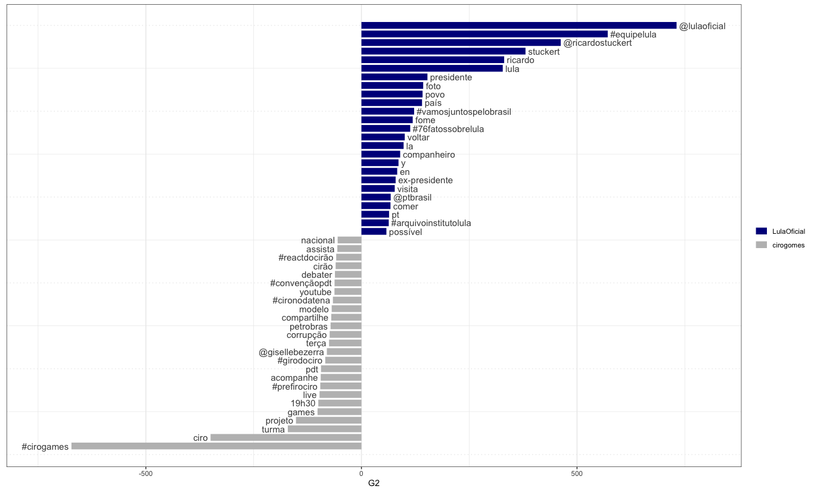
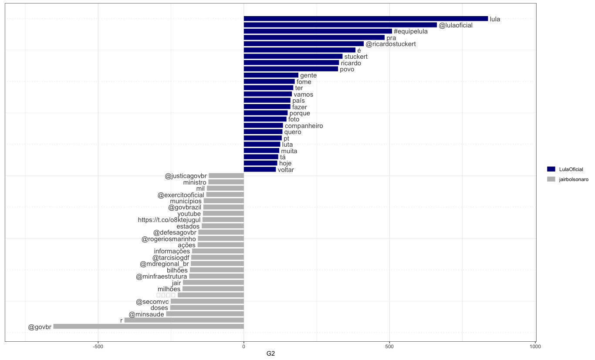
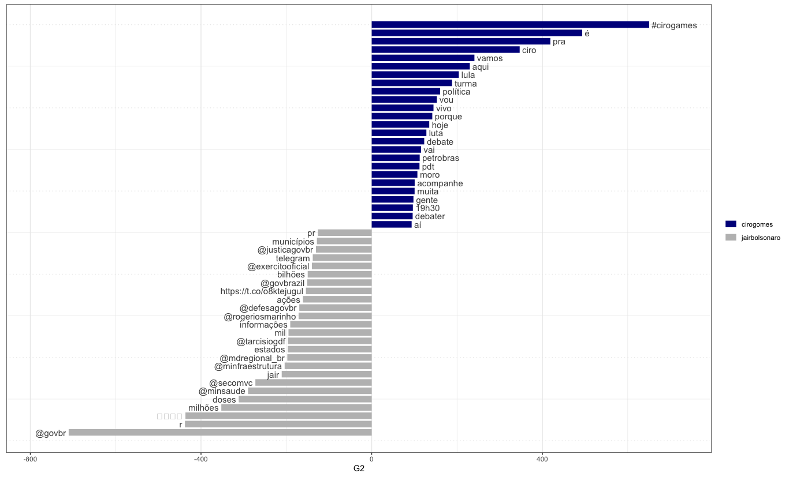

By Rodrigo Esteves de Lima Lopes *University of Campinas* [rll307\@unicamp.br](mailto:rll307@unicamp.br)

------------------------------------------------------------------------

# Quanteda

# Introdução

[Quanteda](https://quanteda.io/) é um pacote para gerenciar e analisar texto quantitativamente. É bastante fácil de usar e nos trará uma série de funções interessantes.

## Você vai precisar de:

1.  O pacote [`Quanteda`](https://quanteda.io/), `quanteda.textplots` e `quanteda.textstats`, que podem ser instalados usando [RStudio](http://www.sthda.com/english/wiki/installing-and-using-r-packages)
2.  O pacote `rtweet`, que instalamos em nosso [primeiro tutorial de Twitter](05_rtweet_E1).
3.  O `Ggplot2` criar alguns gráficos, que foi instalado em nosso [primeiro tutorial de Twitter](05_rtweet_E1).

``` r
# Running the packages
library(quanteda)
library(quanteda.textplots)
library(quanteda.textstats)
```

## Dados

Vamos usar os mesmos dados do tutorial anterior

# Fazendo algumas comparações

## Criação do corpus

Nosso primeiro passo é usar `Quanteda` para criar o corpus. Um corpus, neste contexto, é uma variável formal que permite que o texto interaja com o pacote.

``` r
presidents.C <- corpus(presidents)
```

Nosso próximo passo é criar um corpus para cada um dos candidatos que raspamos  a linha do tempo

``` r
lula.c <- corpus_subset(presidents.C, screen_name == "LulaOficial")
ciro.c <- corpus_subset(presidents.C, screen_name == "cirogomes")
JB.c <- corpus_subset(presidents.C, screen_name == "jairbolsonaro")
```

# Tokenisação

Agora precisamos tokenisar os dados, para que o pacote possa identificar cada palavra como uma unidade de análise.

``` r
#Lula
lula.toc <- tokens(lula.c,
                   remove_punct = TRUE,
                   remove_symbols = TRUE,
                   remove_numbers = TRUE,
                   verbose = TRUE)
lula.toc <- tokens_remove(lula.toc,
                          stopwords("pt"),
                          valuetype = "fixed",
                          verbose = TRUE
                          ) %>% tokens_tolower()

#Ciro
ciro.toc <- tokens(ciro.c,
                   remove_punct = TRUE,
                   remove_symbols = TRUE,
                   remove_numbers = TRUE,
                   verbose = TRUE)
ciro.toc <- tokens_remove(ciro.toc,
                          stopwords("pt"),
                          valuetype = "fixed",
                          verbose = TRUE
                          ) %>% tokens_tolower()
# JB
JB.toc <- tokens(JB.c,
                   remove_punct = TRUE,
                   remove_symbols = TRUE,
                   remove_numbers = TRUE,
                   verbose = TRUE)
JB.toc <- tokens_remove(JB.toc,
                          stopwords("pt"),
                          valuetype = "fixed",
                          verbose = TRUE
                        ) %>% tokens_tolower()

```

# Concordância

O `Quanteda` permite fazer concordância. Vejamos um pouco de  `Kwic`.

``` r
kwic(JB.toc,"Brasil") |> View()
kwic(lula.toc,"Brasil") |> View()
kwic(ciro.toc,"Brasil") |> View()
```

# Bigramas

Que tal analisar como estão os bigramas em cada corpus? Isso nos ajudará a compreender o caráter temático geral dos textos.

``` r
lula.col <- textstat_collocations(lula.toc, method = "lambda",
                                  size = 2,
                                  min_count = 2,
                                  smoothing = 0.5,
                                  tolower = TRUE,
                                  verbose = TRUE)

ciro.col <- textstat_collocations(ciro.toc, method = "lambda",
                                  size = 2,
                                  min_count = 2,
                                  smoothing = 0.5,
                                  tolower = TRUE,
                                  verbose = TRUE)

JB.col <- textstat_collocations(JB.toc, method = "lambda",
                                  size = 2,
                                  min_count = 2,
                                  smoothing = 0.5,
                                  tolower = TRUE,
                                  verbose = TRUE)
```

Vamos usar cada um deles:

``` r
lula.col |> View()
JB.col |> View()
ciro.col |> View()
```

# Comparando e plotando

Nosso próximo passo é comparar os candidatos. Vamos selecioná-los separadamente, para que possamos observar suas palavras mais relevantes:

``` r
a.lula_Ciro <- corpus_subset(presidents.C, screen_name != "jairbolsonaro")
b.lula_JB <- corpus_subset(presidents.C, screen_name != "cirogomes")
c.ciro_JB <- corpus_subset(presidents.C, screen_name != "LulaOficial")
```


Plotagem: 

``` r
# Lula vs ciro
a.tk <- tokens(a.lula_Ciro,
                  remove_punct = TRUE,
                  remove_symbols = TRUE,
                  remove_numbers = TRUE,
                  verbose = TRUE) %>%
  tokens_remove(pattern = stopwords("pt")) %>%
  tokens_group(groups = screen_name)

dfm.a <- dfm(a.tk, verbose = TRUE)

textstat_keyness(dfm.a,
                 target = "LulaOficial",
                 measure = "lr") |> 
  textplot_keyness(n= 25)


# Lula vs JB

b.tk <- tokens(b.lula_JB,
               remove_punct = TRUE,
               remove_symbols = TRUE,
               remove_numbers = TRUE,
               verbose = TRUE) %>%
  tokens_remove(pattern = stopwords("pt")) %>%
  tokens_group(groups = screen_name)

dfm.b <- dfm(b.tk, verbose = TRUE)

textstat_keyness(dfm.b,
                 target = "LulaOficial",
                 measure = "lr") |> 
  textplot_keyness(n= 25)

# Ciro vs JB

c.tk <- tokens(c.ciro_JB,
               remove_punct = TRUE,
               remove_symbols = TRUE,
               remove_numbers = TRUE,
               verbose = TRUE) %>%
  tokens_remove(pattern = stopwords("pt")) %>%
  tokens_group(groups = screen_name)

dfm.c <- dfm(c.tk, verbose = TRUE)

textstat_keyness(dfm.c,
                 target = "cirogomes",
                 measure = "lr") |> 
  textplot_keyness(n= 25)
```






