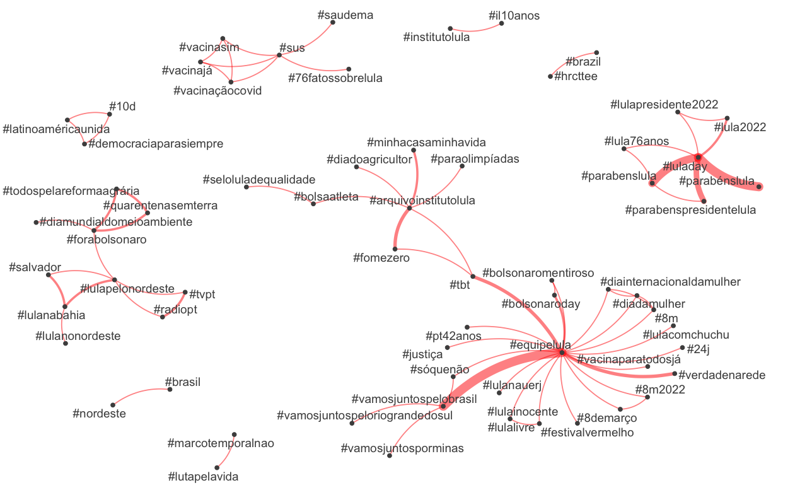
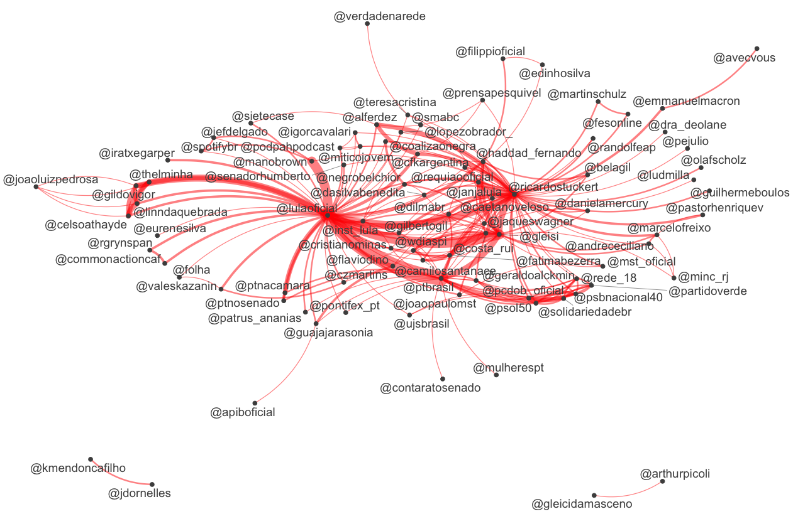
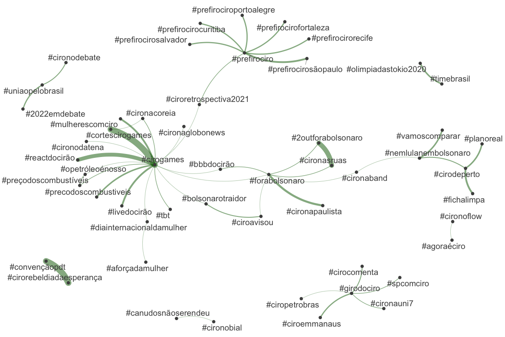
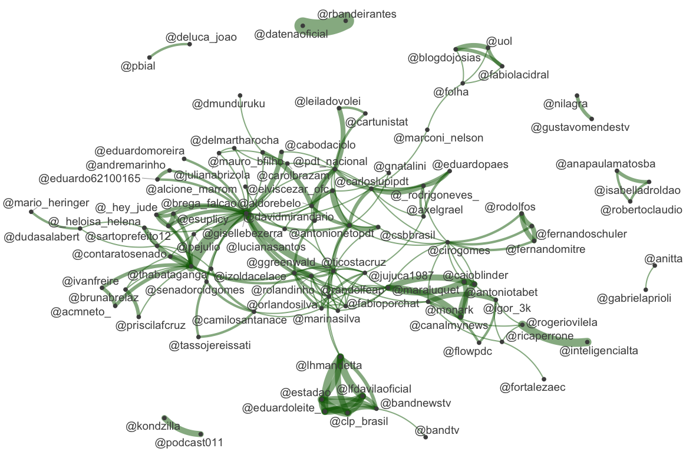
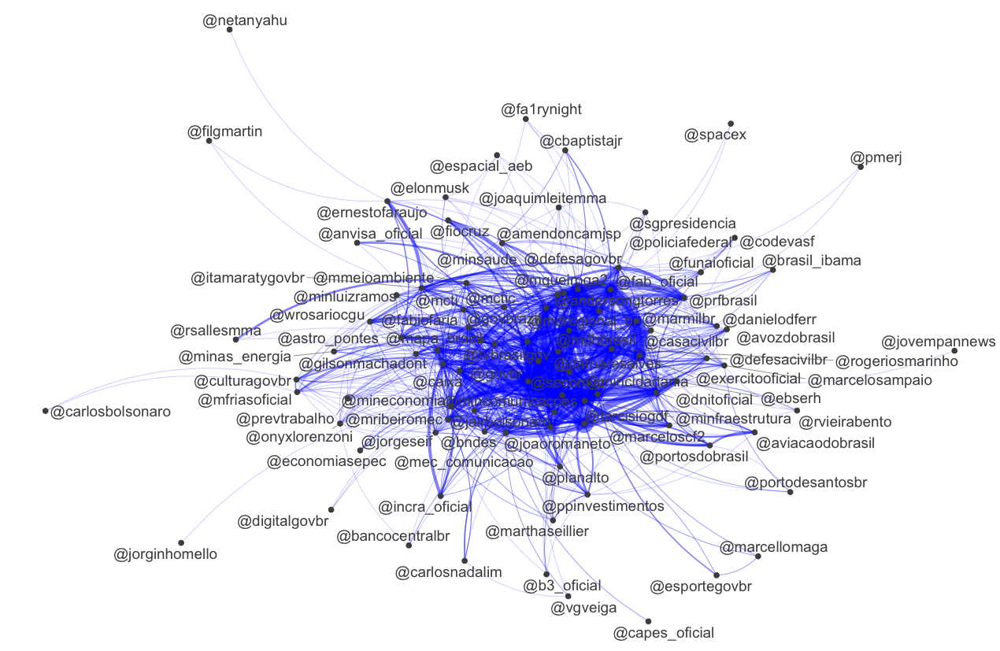

By Rodrigo Esteves de Lima Lopes *University of Campinas* [rll307\@unicamp.br](mailto:rll307@unicamp.br)

------------------------------------------------------------------------

# Algumas análises do twitter com R

## Introdução

Neste tutorial vamos realizar uma análise mais profunda dos pré-candidatos presidenciais brasileiros, buscando padrões de palavras, padrões `@handles` e `#hashtags`. A primeira análise traz alguns comentários extras sobre os conceitos por trás dos códigos, enquanto a seguinte apenas estende a mesma análise para os outros dois pré-candidatos.

# Pacotes

Neste tutorial, os seguintes pacotes serão necessários:

``` r
library(quanteda)
library(quanteda.textplots)
library(quanteda.textstats)
```

-   **Quanteda:** para processar texto

-   **Quanteda.textplots:** para plotar redes

-   **Quanteda.textstats**: para alguns cálculos subjacentes

# A análise

## Lula

### Palavras

Nosso primeiro passo é pegar nossos tokens de corpus e criar um DFM (document-feature matrix). Um DFM nos diz a frequência do léxico em um conjunto de documentos:


``` r
Lula.dfm <- dfm(lula.toc)
```

Uma consequência de trabalharmos com textos pequenos é haver muitos zeros em nossa matriz, um conjunto de dados muito esparso.

Infelizmente, devido ao tempo escaço e capacidade limitada de processamento, não analisaremos todas as palavras nos tweets de nenhum candidato, apenas uma pequena amostra. Portanto, faz sentido amostrar as palavras mais frequentes:

``` r
Lula.top <- names(topfeatures(Lula.dfm, 30))
```

Então, vamos criar uma FCM (Feature Co-Occurrence Matrix) que nos diz como cada característica co-ocorre em um corpus:


``` r
Lula.fcm <-fcm(Lula.dfm)
```

Nosso próximo passo é selecionar os elementos mais frequentes em nossa matriz, usando a variável `Lula.top` que acabamos de criar.

``` r
Lula.top.fcm <- fcm_select(Lula.fcm, pattern = Lula.top)
```

Finalmente, plotamos a rede:

``` r
textplot_network(Lula.top.fcm, 
                 min_freq = 0.1, 
                 edge_alpha = 0.5, 
                 edge_size = 5,
                 edge_color = 'red')
```


### Hashtags

Agora vamos analisar as hashtags. Nosso primeiro passo é selecionar apenas o padrão `#` e criar um DFM.

``` r
Lula.tags <- dfm_select(Lula.dfm, pattern = ("#*"))
```

Selecinando as 100 hashtags mais frequentes:

``` r
Lula.tags.top <- names(topfeatures(Lula.tags, 100))
```

Outro FCM, mas com hashtags exclusivamente:

``` r
Lula.tags.fcm <- fcm(Lula.tags)
```

Selecionando as hashtags do topo

``` r
Lula.top.hash <- fcm_select(Lula.tags.fcm, pattern = Lula.tags.top)
```

Então plotamos:

``` r
textplot_network(Lula.top.hash, 
                 min_freq = 0.1, 
                 edge_alpha = 0.5, 
                 edge_size = 5,
                 edge_color = 'red')
```



### Handles

Se quisermos, podemos fazer o mesmo com os nomes de usuários (ou handles) do Twitter para analisar os usuários mais citados e retuitados de Lula. Temos apenas que substituir `#*` por `@*`. 

Aqui está o código:

``` r
#Selecting the handles
Lula.handle <- dfm_select(Lula.dfm, pattern = ("@*"))
Lula.handle.top <- names(topfeatures(Lula.handle, 100))

# Agora vamos construir um FCM
Lula.handle.fcm <- fcm(Lula.handle)

# Vamos fazer um FCM só com os handles do topo

Lula.top.handles <- fcm_select(Lula.handle.fcm, pattern = Lula.handle.top)

textplot_network(Lula.top.handles, 
                 min_freq = 0.1, 
                 edge_alpha = 0.5, 
                 edge_size = 5,
                 edge_color = 'red')
```

O resultado é:



Podemos salvar este formulário de dados usando outro software que não seja o R.

``` r
Lula.hash.matrix <- convert(Lula.top.hash,to = "matrix")
write.csv(Lula.hash.matrix,"LulaHash.csv")
Lula.handles.matrix <- convert(Lula.top.handles,to = "matrix")
write.csv(Lula.handles.matrix,"LulaHandle.csv")
```

Agora façamos o mesmo para Ciro Gomes e Jair Bolsonaro.

## Ciro Gomes

``` r
#Criando um DFM geral
Ciro.dfm <- dfm(ciro.toc)

#Selecionando as palavras mais frequentes
Ciro.top <- names(topfeatures(Ciro.dfm, 30))
#Selecionando as palavras mais frequentes para imprimir
Ciro.fcm <-fcm(Ciro.dfm)
Ciro.top.fcm <- fcm_select(Ciro.fcm, pattern = Ciro.top)

textplot_network(Ciro.top.fcm, 
                 min_freq = 0.1, 
                 edge_alpha = 0.5, 
                 edge_size = 5,
                 edge_color = 'darkgreen')

#Selecionando a hashtag
Ciro.tags <- dfm_select(Ciro.dfm, pattern = ("#*"))
Ciro.tags.top <- names(topfeatures(Ciro.tags, 100))

# Agora vamos montar uma FCM
Ciro.tags.fcm <- fcm(Ciro.tags)

# Vamos fazer uma FCM só para os hashtags do topo

Ciro.top.hash <- fcm_select(Ciro.tags.fcm, pattern = Ciro.tags.top)

textplot_network(Ciro.top.hash, 
                 min_freq = 0.1, 
                 edge_alpha = 0.5, 
                 edge_size = 5,
                 edge_color = 'darkgreen')

#Selecionando os handles (nomes de usuário)

Ciro.handle <- dfm_select(Ciro.dfm, pattern = ("@*"))
Ciro.handle.top <- names(topfeatures(Ciro.handle, 100))

# Agora vamos montar um FCM
Ciro.handle.fcm <- fcm(Ciro.handle)

# Vamos montar um FCM só com os nomes de usuário do topo

Ciro.top.handles <- fcm_select(Ciro.handle.fcm, pattern = Ciro.handle.top)

textplot_network(Ciro.top.handles, 
                 min_freq = 0.1, 
                 edge_alpha = 0.5, 
                 edge_size = 5,
                 edge_color = 'darkgreen')

# SALVANDO COMO UMA MATRIZ
Ciro.hash.matrix <- convert(Ciro.top.hash,to = "matrix")
write.csv(Ciro.hash.matrix,"CiroHash.csv")

Ciro.handles.matrix <- convert(Ciro.top.handles,to = "matrix")
write.csv(Ciro.handles.matrix,"CiroHandle.csv")
```

Os resultados visuais são:






## Jair Bolsonaro

``` r
#creating a general DFM
JB.dfm <- dfm(JB.toc)

#Selecionando as palavras mais frequentes
JB.top <- names(topfeatures(JB.dfm, 30))
#Seleionando as palavras mais frequentes para imprimir
JB.fcm <-fcm(JB.dfm)
JB.top.fcm <- fcm_select(JB.fcm, pattern = JB.top)

textplot_network(JB.top.fcm, 
                 min_freq = 0.1, 
                 edge_alpha = 0.5, 
                 edge_size = 5,
                 edge_color = 'blue')

#Selecionando a hashtag
JB.tags <- dfm_select(JB.dfm, pattern = ("#*"))
JB.tags.top <- names(topfeatures(JB.tags, 100))

# Agora vamos construir um FCM
JB.tags.fcm <- fcm(JB.tags)

# Vamos montar um FCM só com as haghtags do topo

JB.top.hash <- fcm_select(JB.tags.fcm, pattern = JB.tags.top)

textplot_network(JB.top.hash, 
                 min_freq = 0.1, 
                 edge_alpha = 0.5, 
                 edge_size = 5,
                 edge_color = 'blue')

#Selecionando os handles
JB.handle <- dfm_select(JB.dfm, pattern = ("@*"))
JB.handle.top <- names(topfeatures(JB.handle, 100))

# Vamos montar um FCM
JB.handle.fcm <- fcm(JB.handle)

# Vamos fazer um FCM só com os handles do topo

JB.top.handles <- fcm_select(JB.handle.fcm, pattern = JB.handle.top)

textplot_network(JB.top.handles, 
                 min_freq = 0.1, 
                 edge_alpha = 0.5, 
                 edge_size = 5,
                 edge_color = 'blue')

# SALVANDO COMO UMA MATIZ
JB.hash.matrix <- convert(JB.top.hash,to = "matrix")
write.csv(JB.hash.matrix,"JBHash.csv")

JB.handles.matrix <- convert(JB.top.handles,to = "matrix")
write.csv(JB.handles.matrix,"JBHandle.csv")
```

O resultado visual é:



